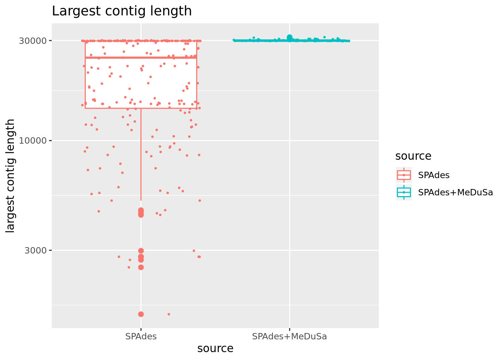

*De novo* genome assembly of *SARS-CoV-2* in a Greek population sample
======================================================================

The process described below can be used for guided *de novo* genome assembly of SARS-CoV-2 using Illumina paired-end sequencing and the Paragon Genomics [CleanPlex® SARS-CoV-2 Panel](https://www.paragongenomics.com/product/cleanplex-sars-cov-2-panel/) in samples extracted from patients in Greece.

It is assumed that the obtained coverage is more that the actual coverage required to obtain the full genome sequence of SARS-CoV-2 and that the samples have to be downsampled in order to satisfy the assumptions of most assemblers. As there is already a reference genome for SARS-CoV-2, we will also use this to estimate the requred coverage to obtain one full contig representing the *de novo* assembled genome of the virus.

Briefly, we are applying the following steps, assuming that we are starting from raw demultiplexed FASTQ files:

### File preparation

1.  Adapter trimming
2.  Filtering of low quality reads (if any)

### Estimation of required coverage

1.  Given one sample, we perform normalization at different depths.
2.  For each depth, we align the normalized FASTQ files to the reference genome.
3.  We visualize the results.
4.  For each depth, we are performing *de novo* genome assembly using SPAdes.
5.  We assess the quality of each SPAdes assembly using BLAT.
6.  We assess the quality of each SPAdes assembly using QUAST.

### *de novo* genome assembly for all samples

1.  Having estimated the adequate coverage, we normalize all samples to the desired depth
2.  We perform assembly with SPAdes
3.  We assess each assembly using QUAST
4.  If we have incomplete assemblies, we are trying to complete them with Medusa

Prerequisites
=============

This section lists the software required to perform the *de novo* genome assembly of the virus under investigation (SARS-CoV-2) from paired-end Illumina reads. Installation instructions can be found to the page of each software. Most recent versions are preferred.

-   [FastQC](https://www.bioinformatics.babraham.ac.uk/projects/fastqc/)
-   [cutadapt](https://cutadapt.readthedocs.io/)
-   [Trim Galore!](https://www.bioinformatics.babraham.ac.uk/projects/trim_galore/)
-   [BBNorm](https://jgi.doe.gov/data-and-tools/bbtools/bb-tools-user-guide/bbnorm-guide/)
-   [bwa](http://bio-bwa.sourceforge.net/)
-   [samtools](http://www.htslib.org/)
-   [bedtools](https://bedtools.readthedocs.io/en/latest/)
-   [SPAdes](http://cab.spbu.ru/files/release3.12.0/manual.html)
-   [QUAST](http://quast.sourceforge.net/quast)
-   [MeDuSa](https://github.com/combogenomics/medusa)
-   [MUMmmer](http://mummer.sourceforge.net/)
-   [Jim Kent UCSC tools](http://hgdownload.soe.ucsc.edu/admin/exe/)
-   [Integrative Genome Browser](http://software.broadinstitute.org/software/igv/)
-   [pigz parallel file compressor](https://zlib.net/pigz/)

Some of these packages are demanding in terms of prerequisites. Maybe the most tricky one is Medusa which depends on MUMmer and Biopython. However, the latest Biopython version does not support Python 2.7 so if you wish to stick to Python 2.7, then you must explicitly install Biopython 1.76:

    pip install biopython==1.76

After that, MUMmer must become available to the `PATH` so either

    export PATH=$PATH:/path/to/mummer/executable

or attach `/path/to/mummer/executable` to the `PATH` variable in `~/.bashrc`:

    echo PATH=$PATH:/path/to/mummer/executable >> ~/.bashrc
    source ~/.bashrc

Quality control and filtering
=============================

*De novo* genome assembly is a process very sensitive to sequencing errors, as few errors may significantly alter the quality of the end-product. Therefore, a rather strict quality control procedure must be followed to ensure the required quality or to reject samples of very low quality. In this section we describe the steps performed to check the quality of the raw sequencing data and decide if any actions are required to be performed to improve quality prior to assembly.

First run of FastQC
-------------------

Firstly, we run a first round of QC using FastQC to determine if any actions need to be taken. The following bash script can be used as a template:

    #!/bin/bash

    HOME_PATH=/PATH/TO/ANALYSIS/DIRECTORY
    FASTQ_PATH=$HOME_PATH/fastq
    FASTQ_PATTERN=*.fastq.gz
    FASTQC_COMMAND=/PATH/TO/FastQC/fastqc
    FASTQC_OUTPUT=$HOME_PATH/fastqc
    CORES=8

    if [ ! -d $FASTQC_OUTPUT ]
    then
        mkdir -p $FASTQC_OUTPUT
    fi

    $FASTQC_COMMAND --outdir $FASTQC_OUTPUT --threads $CORES $FASTQ_PATH/$FASTQ_PATTERN

From the results of FastQC, a lot of useful information may be revealed. Some examples include:

1.  The presence of adapters
2.  The presence of bias in the 3'/5' end of reads
3.  Poor quality in the 3'/5' end of reads
4.  Poor quality for certain samples
5.  Sequence over-representation other than adapters

In our case, we see points (1) and (5) above. Point (5) can be discarded due to very high coverage.


Adapter and poor quality base trimming
--------------------------------------

After a first round of inspection, we need to improve the quality of the overall dataset prior to continuing with other actions regarding the assembly. [Trim Galore!](https://www.bioinformatics.babraham.ac.uk/projects/trim_galore/) is a good option for this as it automates many processes for you, including standard adapter automated removal and taking care of paired-end reads.

As later assembly tools (SPAdes in our case) also perform read error correction, we will use a soft filtering strategy and then let SPAdes do the rest of the error corrections. Also by default, Trim Galore! is not very aggressive.

A template bash script to wrap Trim Galore! follows. With comments, below the main command, an alternative more strict filtering approach:

    #!/bin/bash

    HOME_PATH=/PATH/TO/ANALYSIS/DIRECTORY
    FASTQ_PATH=$HOME_PATH/fastq
    TRIMGALORE_OUTPUT=$HOME_PATH/fastq_qual
    TRIMGALORE_COMMAND=/PATH/TO/TrimGalore/trim_galore
    CORES=8

    if [ ! -d $TRIMGALORE_OUTPUT ]
    then
        mkdir -p $TRIMGALORE_OUTPUT
    fi

    for FILE in $FASTQ_PATH/*_R1_001.fastq.gz
    do
        BASE=`basename $FILE | sed s/_R1_001\.fastq\.gz//`
        echo "Processing $BASE"
        mkdir -p $TRIMGALORE_OUTPUT/$BASE
        F1=$FASTQ_PATH/$BASE"_R1_001.fastq.gz"
        F2=$FASTQ_PATH/$BASE"_R2_001.fastq.gz"
        $TRIMGALORE_COMMAND \
            --length 50 \
            --output_dir $TRIMGALORE_OUTPUT/$BASE \
            --path_to_cutadapt /opt/ngstools/cutadapt/cutadapt \
            --cores $CORES \
            --paired \
            --retain_unpaired \
            --fastqc \
            --trim-n $F1 $F2
            
        mv $TRIMGALORE_OUTPUT/$BASE/$BASE"_R1_001_val_1.fq.gz" \
            $TRIMGALORE_OUTPUT/$BASE/$BASE"_R1_TG.fastq.gz"
        mv $TRIMGALORE_OUTPUT/$BASE/$BASE"_R2_001_val_2.fq.gz" \
            $TRIMGALORE_OUTPUT/$BASE/$BASE"_R2_TG.fastq.gz"
        mv $TRIMGALORE_OUTPUT/$BASE/$BASE"_R1_001_val_1_fastqc.html" \
            $TRIMGALORE_OUTPUT/$BASE/$BASE"_R1_fastqc.html"
        mv $TRIMGALORE_OUTPUT/$BASE/$BASE"_R1_001_val_1_fastqc.zip" \
            $TRIMGALORE_OUTPUT/$BASE/$BASE"_R1_fastqc.zip"    
        mv $TRIMGALORE_OUTPUT/$BASE/$BASE"_R2_001_val_2_fastqc.html" \
            $TRIMGALORE_OUTPUT/$BASE/$BASE"_R2_fastqc.html"
        mv $TRIMGALORE_OUTPUT/$BASE/$BASE"_R2_001_val_2_fastqc.zip" \
            $TRIMGALORE_OUTPUT/$BASE/$BASE"_R2_fastqc.zip"
        mv $TRIMGALORE_OUTPUT/$BASE/$BASE"_R1_001.fastq.gz_trimming_report.txt" \
            $TRIMGALORE_OUTPUT/$BASE/$BASE"_R1_trimming_report.txt"
        mv $TRIMGALORE_OUTPUT/$BASE/$BASE"_R2_001.fastq.gz_trimming_report.txt" \
            $TRIMGALORE_OUTPUT/$BASE/$BASE"_R2_trimming_report.txt"
            
        if [ -f  $TRIMGALORE_OUTPUT/$BASE/$BASE"_R1_001_unpaired_1.fq.gz" ]
        then
            zcat $TRIMGALORE_OUTPUT/$BASE/$BASE"_R1_001_unpaired_1.fq.gz" \
                $TRIMGALORE_OUTPUT/$BASE/$BASE"_R2_001_unpaired_2.fq.gz" \
                | pigz > $TRIMGALORE_OUTPUT/$BASE/$BASE"_S_TG.fastq.gz"
            rm $TRIMGALORE_OUTPUT/$BASE/$BASE"_R1_001_unpaired_1.fq.gz" \
                $TRIMGALORE_OUTPUT/$BASE/$BASE"_R2_001_unpaired_2.fq.gz"
        fi
    done

For paired-end reads, Trim Galore! produces four outputs: - Mate 1 reads passing QC - Mate 2 reads passing QC (and matched to mate 1) - Mate 1 failed reads - Mate 2 failed reads

We have concatenated all the failed reads to one file to be later fed to the assembly pipelines.

Alternative adapter trimming
----------------------------

Although TrimGalore! works very well, we may feel safer running also the suggested workflow Paragon Genomics which uses `cutadapt` but does not perform any quality trimming. Therefore, we apply `cutadapt` after the Trim Galore! process. It should be noted that quality trimming is a very important step as when we tried to perform *de novo* assembly by using the Paragon Genomics recommendation alone, SPAdes not only did not manage to assemble the SARS-CoV-2 genome at the tested coverages (20x, 50x, 100x, 200x) but the assembled contig coverage was also very low.

A template bash script to wrap the suggested cutadapt run **after** Trim Galore! follows:

    #!/bin/bash

    HOME_PATH=/PATH/TO/ANALYSIS/DIRECTORY
    FASTQ_PATH=$HOME_PATH/fastq
    CUTADAPT_OUTPUT=$FASTQ_PATH
    CUTADAPT_COMMAND=/PATH/TO/cutadapt/cutadapt
    CORES=8

    for BASE in `ls $FASTQ_PATH`
    do
        echo "Processing $BASE"
        F1=$FASTQ_PATH/$BASE/$BASE"_R1_TG.fastq.gz"
        F2=$FASTQ_PATH/$BASE/$BASE"_R2_TG.fastq.gz"
        $CUTADAPT_COMMAND \
            -a AGATCGGAAGAGCACACGTCTGAA \
            -g CCTACACGACGCTCTTCCGATCT \
            -A AGATCGGAAGAGCGTCGTGTAGG \
            -G TTCAGACGTGTGCTCTTCCGATCT \
            -e 0.1 \
            -O 9 \
            -m 20 \
            -n 2 \
            -j 8 \
            -o $CUTADAPT_OUTPUT/$BASE/$BASE"_R1.fastq.gz" \
            -p $CUTADAPT_OUTPUT/$BASE/$BASE"_R2.fastq.gz" $F1 $F2 > \
            $CUTADAPT_OUTPUT/$BASE/cutadapt_report.txt
    done

For paired-end reads, cutadapt produces two outputs: - Trimmed mate 1 reads - Trimmed mate 2 reads

In this guide, we are not going to use the reads that lost their mate after Trim Galore! processing, although for larger assembly projects, it is recommended that they are used as assemblers use them to support the process.

Estimation of required coverage
===============================

In this section we take one sample and normalize at a few different depths. We are using the reference genome to align, visualize and inspect the results and we are performing *de novo* assembly for each depth. We assess the quality using QUAST (and optionally BLAT in UCSC Genome Browser).

Reference genome
----------------

We are donwloading and indexing the SARS-CoV-2 reference genome from UCSC. The following commands can be used:

    HOME_PATH=/PATH/TO/ANALYSIS/DIRECTORY
    REF_PATH=$HOME_PATH/reference
    BWA_COMMAND=/PATH/TO/bwa/bwa

    mkdir -p $REF_PATH
    CWD=`pwd`
    cd $REF_PATH
    wget http://hgdownload.soe.ucsc.edu/goldenPath/wuhCor1/bigZips/wuhCor1.fa.gz
    pigz -d wuhCor1.fa.gz
    $BWA_COMMAND index wuhCor1.fa
    cd $CWD

Normalization and coverage estimation process
---------------------------------------------

We are using the first sample (alphabetically) for the steps to be followed below. This sample is called `10_S51`. For the coverage normalization of the processed FASTQ file we are using the BBNorm suite and the `bbnorm.sh` tool. Here, we are testing four different desired coverage levels, namely 20x, 50x, 100x and 200x. For each normalized case we are then mapping the resulting normalized FASTQ file to the existing SARS-CoV-2 reference genome to later produce a signal visualization in BigWig format in order to assess the effectiveness of the coverage normalization process by BBNorm. While initially the signal is not uniform across the SARS-CoV-2 genome and there are areas with large coverage differences, BBNorm manages to produce a satisfying uniform coverage result. De nove genome assemblers work much better if the coverage is uniform and the depth is reasonable.

Using the results from BBNorm, we perform *de novo* genome assembly with SPAdes and we assess each assembly with QUAST. Since we have a reference genome, the assessment is more comprehensible. QUAST produces a very detailed HTML report with various metrics that can be used to assess and improve the assembly.

All the aforementioned process can be accomplished with the following template script:

    #!/bin/bash

    HOME_PATH=/PATH/TO/ANALYSIS/DIRECTORY
    FASTQ_PATH=$HOME_PATH/fastq_qual
    REFERENCE_PATH=$HOME_PATH/reference
    BBNORM_TEST_OUTPUT=$HOME_PATH/bbnorm_test

    GENOME_INDEX=$REFERENCE_PATH/wuhCor1.fa

    BBNORM_COMMAND=/PATH/TO/bbmap/bbnorm.sh
    BWA_COMMAND=/PATH/TO/bwa/bwa
    SAMTOOLS_COMMAND=/PATH/TO/samtools/samtools
    BEDTOOLS_COMMAND=/PATH/TO/bedtools/bedtools
    SPADES_COMMAND=/PATH/TO/spades/spades.py
    QUAST_COMMAND=/PATH/TO/quast/quast.py
    KENT_HOME=/PATH/TO/kent

    CORES=8

    if [ ! -d $BBNORM_TEST_OUTPUT ]
    then
        mkdir -p $BBNORM_TEST_OUTPUT
    fi

    BASE=`ls $FASTQ_PATH | head -1`
    for DP in 20 50 100 200
    do
        echo "Processing desired depth $DP"
        CURRENT_OUTPATH=$BBNORM_TEST_OUTPUT/$DP"x"
        mkdir -p $CURRENT_OUTPATH
        F1=$FASTQ_PATH/$BASE/$BASE"_R1.fastq"
        F2=$FASTQ_PATH/$BASE/$BASE"_R2.fastq"
        pigz -d $F1".gz" $F2".gz"
        
        $BBNORM_COMMAND \
            in=$F1 \
            in2=$F2 \
            out=$CURRENT_OUTPATH/$BASE"_R1.fastq" \
            out2=$CURRENT_OUTPATH/$BASE"_R2.fastq" \
            min=5 \
            target=$DP \
            fixspikes=t \
            threads=$CORES
        
        pigz $F1 $F2
            
        $BWA_COMMAND mem \
            -t $CORES \
            $GENOME_INDEX \
            $CURRENT_OUTPATH/$BASE"_R1.fastq" \
            $CURRENT_OUTPATH/$BASE"_R2.fastq" | \
            $SAMTOOLS_COMMAND view -bS -o $BBNORM_TEST_OUTPUT/$DP"x"/$BASE".uns"
        
        $SAMTOOLS_COMMAND sort \
            $CURRENT_OUTPATH/$BASE".uns" \
            -o $CURRENT_OUTPATH/$BASE".bam"
        
        # Extract genome size for bedGraphToBigWig
        $SAMTOOLS_COMMAND view \
            -H $CURRENT_OUTPATH/$BASE".bam" | \
            grep '^@SQ' | sed s/@SQ\\tSN:// | sed s/\\tLN:/\\t/ > \
            $CURRENT_OUTPATH/genome.size
        
        $BEDTOOLS_COMMAND genomecov -bg \
            -ibam $CURRENT_OUTPATH/$BASE".bam" | sort -k1,1 -k2g,2 > \
            $CURRENT_OUTPATH/$BASE".bedGraph"
        
        $KENT_HOME/bedGraphToBigWig $CURRENT_OUTPATH/$BASE".bedGraph" \
             $CURRENT_OUTPATH/genome.size $CURRENT_OUTPATH/$BASE".bigWig"
        
        rm $CURRENT_OUTPATH/$BASE".uns" $CURRENT_OUTPATH/$BASE".bedGraph"
        
        #echo "track type=bigWig name=$BASE_$DPx color=100,100,100 visibility=full maxHeightPixels=128:64:16 bigDataUrl=$BIGDATAURL/$BASE.bigWig" >> \
        #    $BBNORM_TEST_OUTPUT/tracks.txt
        
        $SPADES_COMMAND \
            -1 $CURRENT_OUTPATH/$BASE"_R1.fastq" \
            -2 $CURRENT_OUTPATH/$BASE"_R2.fastq" \
            -o $CURRENT_OUTPATH/spades \
            --threads $CORES --careful
        
        $QUAST_COMMAND \
            -r $GENOME_INDEX \
            -o $CURRENT_OUTPATH/quast \
            $CURRENT_OUTPATH/spades/scaffolds.fasta
        
        pigz $CURRENT_OUTPATH/$BASE"_R1.fastq" $CURRENT_OUTPATH/$BASE"_R2.fastq"
    done

In order to visualize the resulting gene signals The resulting BigWig files must be put in a folder served by a web server such as Apache. Then they can be visualized in the UCSC Genome Browser by constructing track lines. Local solutions such as IGV can be used if a web server is not available.


*De novo* assembly and assessment
=================================

In this section we are normalizing each sample to 100x coverage using BBNorm as before followed by SPAdes assembly. Then we are using QUAST to assess each assembly. For the assemblies that are not complete, we are usng MeDuSa with the reference genome. We can also use one of the assembled genomes to complete it as it would be more appropriate to use one of our local genomes as they are specific to the population examined. However, in practice there are no differences.

First pass and assessment at 100x
---------------------------------

The following template script can be used for the aforementioned processes:

    #!/bin/bash

    HOME_PATH=/PATH/TO/ANALYSIS/DIRECTORY
    FASTQ_PATH=$HOME_PATH/fastq_qual
    REFERENCE_PATH=$HOME_PATH/reference
    ASSEMBLY_PATH=$HOME_PATH/assembly

    GENOME_INDEX=$REFERENCE_PATH/wuhCor1.fa

    BBNORM_COMMAND=/PATH/TO/bbmap/bbnorm.sh
    SPADES_COMMAND=/PATH/TO/spades/spades.py
    QUAST_COMMAND=/PATH/TO/quast/quast.py

    CORES=8

    if [ ! -d $ASSEMBLY_PATH ]
    then
        mkdir -p $ASSEMBLY_PATH
    fi

    for BASE in `ls $FASTQ_PATH`
    do
        echo "Processing $BASE"
        CURRENT_OUTPATH=$ASSEMBLY_PATH/$BASE
        mkdir -p $CURRENT_OUTPATH
        F1=$FASTQ_PATH/$BASE/$BASE"_R1.fastq"
        F2=$FASTQ_PATH/$BASE/$BASE"_R2.fastq"
        pigz -d $F1".gz" $F2".gz"
        
        $BBNORM_COMMAND \
            in=$F1 \
            in2=$F2 \
            out=$CURRENT_OUTPATH/$BASE"_R1.fastq" \
            out2=$CURRENT_OUTPATH/$BASE"_R2.fastq" \
            min=5 \
            target=100 \
            fixspikes=t \
            deterministic=t \
            threads=$CORES
        
        pigz $F1 $F2
        
        $SPADES_COMMAND \
            -1 $CURRENT_OUTPATH/$BASE"_R1.fastq" \
            -2 $CURRENT_OUTPATH/$BASE"_R2.fastq" \
            -o $CURRENT_OUTPATH/spades \
            --threads $CORES --careful
        
        $QUAST_COMMAND \
            -r $GENOME_INDEX \
            -o $CURRENT_OUTPATH/quast \
            $CURRENT_OUTPATH/spades/scaffolds.fasta
        
        pigz $CURRENT_OUTPATH/$BASE"_R1.fastq" $CURRENT_OUTPATH/$BASE"_R2.fastq"
    done

Now, by processing QUAST output, we can make a table of how well our assembly process performed overall. Note that if we get many samples with incomplete genomes, we can repeat the process with a normalization to 200x or even more coverage.

The following script template can be used to process QUAST output:

    #!/bin/bash
    HOME_PATH=/PATH/TO/ANALYSIS/DIRECTORY
    ASSEMBLY_PATH=$HOME_PATH/assembly

    if [! -d $HOME_PATH/scripts/files ]
    then
        mkdir -p $HOME_PATH/scripts/files
    fi

    SPADES_OUT_100x="stats_100x.txt"

    printf "%s\t%s\t%s\t%s\t%s\t%s\t%s\t%s\n" "name" "number of contigs" \
        "largest contig length" "GC (%)" "N50" "L50" "wuhCor1 match (%)" > \
         $SPADES_OUT_100x

    for BASE in `ls $ASSEMBLY_PATH`
    do
        echo "Processing $BASE..."
        
        QUAST_100x=$ASSEMBLY_PATH/$BASE/quast/report.txt
        
        # names
        printf "%s\t" $BASE >> $SPADES_OUT_100x
            
        # # contigs
        printf "%d\t" `cat $QUAST_100x | head -16 | tail -1 | \
            awk '{print $3}'` >> $SPADES_OUT_100x
        
        # length of largest contig
        printf "%d\t" `cat $QUAST_100x | head -17 | tail -1 | \
            awk '{print $3}'` >> $SPADES_OUT_100x
        
        # GC content
        printf "%s\t" `cat $QUAST_100x | head -20 | tail -1 | \
            awk '{print $3"%"}'` >> $SPADES_OUT_100x
            
        # N50
        printf "%d\t" `cat $QUAST_100x | head -22 | tail -1 | \
            awk '{print $2}'` >> $SPADES_OUT_100x
        
        # L50
        printf "%d\t" `cat $QUAST_100x | head -26 | tail -1 | \
            awk '{print $2}'` >> $SPADES_OUT_100x
        
        # wuhCor1 match (%)
        printf "%s\n" `cat $QUAST_100x | head -39 | tail -1 | \
            awk '{print $4"%"}'` >> $SPADES_OUT_100x
    done

We can perform some basic exploration of the results for 100x coverage in R:

``` r
library(ggplot2)

stats100 <- read.delim("files/stats_100x.txt", check.names = FALSE)

summary(stats100)
##       name    number of contigs largest contig length     GC (%)  
##  1_S1   : 1   Min.   : 1.0      Min.   : 2794         38.00% :31  
##  10_S51 : 1   1st Qu.: 1.0      1st Qu.:15058         38.01% :18  
##  11_S36 : 1   Median : 2.0      Median :25986         37.99% :12  
##  13_S24 : 1   Mean   : 2.6      Mean   :22689         38.02% : 7  
##  14_S25 : 1   3rd Qu.: 3.0      3rd Qu.:29868         37.98% : 5  
##  16_S45 : 1   Max.   :20.0      Max.   :30052         37.97% : 3  
##  (Other):79                                           (Other): 9  
##       N50             L50        wuhCor1 match (%)               
##  Min.   : 1424   Min.   :1.000   99.883%:38        Mode:logical  
##  1st Qu.:15058   1st Qu.:1.000   99.886%: 5        NA's:85       
##  Median :25986   Median :1.000   99.843%: 4                      
##  Mean   :22271   Mean   :1.271   99.813%: 3                      
##  3rd Qu.:29868   3rd Qu.:1.000   99.826%: 2                      
##  Max.   :30052   Max.   :7.000   99.846%: 2                      
##                                  (Other):31
```

``` r
# Boxplot of number of contigs
stats100$coverage <- rep("100x", nrow(stats100))
ggplot(data = stats100) + geom_boxplot(aes(x = coverage, y = `number of contigs`, 
    color = coverage), outlier.size = 2) + geom_jitter(aes(x = coverage, y = `number of contigs`, 
    color = coverage), size = 0.5) + scale_y_continuous(breaks = seq(0, max(stats100$`number of contigs`), 
    by = 2))
```


Based on the results, we can see that while we have a great match with the SARS-CoV-2 reference genome, quite some samples fail to assemble into one main contig, while nevertheless spanning the virus genome, as can be seen from the average percentage.

Second pass and assessment at 200x and 300x
-------------------------------------------

Based on the first pass results, we can extend our normalization and assembly script to span 200x and 300x coverages to see if we can get better overall results.

    #!/bin/bash

    HOME_PATH=/PATH/TO/ANALYSIS/DIRECTORY
    ASSEMBLY_PATH=$HOME_PATH/assembly

    if [! -d $HOME_PATH/scripts/files ]
    then
        mkdir -p $HOME_PATH/scripts/files
    fi

    STATS_OUT="stats.txt"

    printf "%s\t%s\t%s\t%s\t%s\t%s\t%s\t%s\n" "name" "number of contigs" \
        "largest contig length" "GC (%)" "N50" "L50" "wuhCor1 match (%)" \
         "coverage" > $STATS_OUT

    for X in `ls $ASSEMBLY_PATH`
    do
        echo "Processing $X..."
        for BASE in `ls $ASSEMBLY_PATH/$X`
        do
            echo "  Processing $BASE..."
            
            QUAST_REPORT=$ASSEMBLY_PATH/$X/$BASE/quast/report.txt
            
            # names
            printf "%s\t" $BASE >> $STATS_OUT
                
            # # contigs
            printf "%d\t" `cat $QUAST_REPORT | head -16 | tail -1 | \
                awk '{print $3}'` >> $STATS_OUT
            
            # length of largest contig
            printf "%d\t" `cat $QUAST_REPORT | head -17 | tail -1 | \
                awk '{print $3}'` >> $STATS_OUT
            
            # GC content
            printf "%s\t" `cat $QUAST_REPORT | head -20 | tail -1 | \
                awk '{print $3"%"}'` >> $STATS_OUT
                
            # N50
            printf "%d\t" `cat $QUAST_REPORT | head -22 | tail -1 | \
                awk '{print $2}'` >> $STATS_OUT
            
            # L50
            printf "%d\t" `cat $QUAST_REPORT | head -26 | tail -1 | \
                awk '{print $2}'` >> $STATS_OUT
            
            # wuhCor1 match (%)
            printf "%s\t" `cat $QUAST_REPORT | head -39 | tail -1 | \
                awk '{print $4"%"}'` >> $STATS_OUT
            
            # coverage x
            printf "%s\n" $X >> $STATS_OUT
        done
    done

We can then perform some additional exploration of the results in R so as to inspect if the coverage increase really improves the results. Prior to creating some evaluation figures, we need to define two important measurements in genome assemblies:

-   **L50**: Given a set of contigs, each with its own length, the L50 count is defined as the smallest number of contigs whose length sum makes up half of genome size.

-   **N50**: N50 statistic defines assembly quality in terms of contiguity. Given a set of contigs, the N50 is defined as the sequence length of the shortest contig at 50% of the total genome length. It can be thought of as the point of half of the mass of the distribution; the number of bases from all contigs longer than the N50 will be close to the number of bases from all contigs shorter than the N50.

``` r
covidStats <- read.delim("files/stats.txt", check.names = FALSE)

# Boxplot of number of contigs
ggplot(data = covidStats) + geom_boxplot(aes(x = coverage, y = `number of contigs`, 
    color = coverage), outlier.size = 2) + geom_jitter(aes(x = coverage, y = `number of contigs`, 
    color = coverage), size = 0.5) + scale_y_continuous(breaks = seq(0, max(covidStats$`number of contigs`), 
    by = 2)) + ggtitle("Number of contigs per coverage")
```


``` r
# Boxplot of L50 statistic
ggplot(data = covidStats) + geom_boxplot(aes(x = coverage, y = L50, color = coverage), 
    outlier.size = 2) + geom_jitter(aes(x = coverage, y = L50, color = coverage), 
    size = 0.5) + scale_y_continuous(breaks = seq(0, max(covidStats$L50), by = 2)) + 
    ggtitle("L50 per coverage")
```


``` r
# Boxplot of N50 statistic
ggplot(data = covidStats) + geom_boxplot(aes(x = coverage, y = N50, color = coverage), 
    outlier.size = 2) + geom_jitter(aes(x = coverage, y = N50, color = coverage), 
    size = 0.5) + scale_y_continuous(trans = "log10") + ggtitle("N50 per coverage")
```


``` r
# Boxplot of largest contig length
ggplot(data = covidStats) + geom_boxplot(aes(x = coverage, y = `largest contig length`, 
    color = coverage), outlier.size = 2) + geom_jitter(aes(x = coverage, y = `largest contig length`, 
    color = coverage), size = 0.5) + scale_y_continuous(trans = "log10") + ggtitle("Largest contig length")
```


``` r
# Boxplot of match percentage with the reference genome
D <- covidStats
D$`wuhCor1 match (%)` <- as.numeric(gsub("%", "", D$`wuhCor1 match (%)`))
ggplot(data = D) + geom_boxplot(aes(x = coverage, y = `wuhCor1 match (%)`, color = coverage), 
    outlier.size = 2) + geom_jitter(aes(x = coverage, y = `wuhCor1 match (%)`, color = coverage), 
    size = 0.5) + ggtitle("Match with the reference genome")
```


From the figures above we can extract the following results

1.  In all cases and with all metric inspected, 100x coverage gives the best outcomes. This is to be expected, given the length of the genome under investigation and how the assemblers work.
2.  The median number of contigs from the related assemblies population is **2**. Also the majority of number of contigs for each case is concentrated in the range 1-4.
3.  The median L50 is 1, which means that the first contig captures the majority of the genome under investigation each time. The majoroty of L50 values is again mostly 1 and 2.
4.  The median N50 is close to 30kb in 100x and 200x coverage wiht the majority of N50s being concentrated very close to 30kb which is the length of the genome under investigation.
5.  The same observation as in (4) applies when we plot the largest contig length.
6.  If one inspects individual QUAST outputs and use (we leave this as exercise) [BLAT](http://genome-euro.ucsc.edu/cgi-bin/hgBlat?command=start) to query the contigs of a couple of samples against the reference genome, we can see that the contigs are either complementary or slightly overlap but in most cases span the whole genome.

Therefore, we can state that the optimal coverage to use is 100x (with BBNorm normalization) and given the SARS-CoV-2 reference genome, it should be quite straightforward to complete the assemblies using tools such as Ragout.

Completing the assemblies
=========================

In this section we will try to complete the *de novo* assemblies using the existing reference genome and MeDuSa and rerun QUAST to gather asembly statistics for later assessment. The following script template should do the work:

    #!/bin/bash

    HOME_PATH=/PATH/TO/ANALYSIS/DIRECTORY
    ASSEMBLY_PATH=$HOME_PATH/assembly/100x

    REFERENCE_PATH=$HOME_PATH/reference
    GENOME_INDEX=$REFERENCE_PATH/wuhCor1.fa

    MUMMER_PATH=/opt/ngstools/mummer
    MEDUSA_PATH=/opt/ngstools/medusa

    # Just to be sure
    export PATH=$PATH:$MUMMER_PATH

    for BASE in `ls $ASSEMBLY_PATH`
    do
        echo "Processing $BASE..."
        
        SPADES_OUT=$ASSEMBLY_PATH/$BASE/spades/scaffolds.fasta
        MEDUSA_OUT=$ASSEMBLY_PATH/$BASE/medusa
        
        if [ -d $MEDUSA_OUT ]
        then
            rm -r $MEDUSA_OUT
        fi
        mkdir -p $MEDUSA_OUT
        mkdir -p $MEDUSA_OUT/draft
        
        # Could be a symbolic link if not working in SMB share
        cp $GENOME_INDEX $MEDUSA_OUT/draft/
        
        java -jar $MEDUSA_PATH/medusa.jar -v \
            -f $MEDUSA_OUT/draft \
            -i $SPADES_OUT \
            -o $MEDUSA_OUT/medusa.fasta \
            -scriptPath $MEDUSA_PATH/medusa_scripts
            
        rm -r $MEDUSA_OUT/draft
        
        # If medusa does not correct, it does not write anything to the output...
        # In this case we must copy the original to the output to have a consistent
        # output for QUAST
        
        if [ ! -f $MEDUSA_OUT/medusa.fasta ]
        then
            cp $SPADES_OUT $MEDUSA_OUT/medusa.fasta
        fi
        
        
        $QUAST_COMMAND \
            -r $GENOME_INDEX \
            -o $MEDUSA_OUT/quast \
            $MEDUSA_OUT/medusa.fasta
    done

After MeDuSa attempt to complete the genomes, we are calculating again some statistics to assess the completion process.

    #!/bin/bash

    HOME_PATH=/PATH/TO/ANALYSIS/DIRECTORY
    ASSEMBLY_PATH=$HOME_PATH/assembly/100x

    MEDUSA_OUT="stats_100x_medusa.txt"

    printf "%s\t%s\t%s\t%s\t%s\t%s\t%s\t%s\n" "name" "number of contigs" \
        "largest contig length" "GC (%)" "N50" "L50" "wuhCor1 match (%)" > \
         $MEDUSA_OUT

    for BASE in `ls $ASSEMBLY_PATH`
    do
        echo "Processing $BASE..."
        
        QUAST_100x=$ASSEMBLY_PATH/$BASE/medusa/quast/report.txt
        
        # names
        printf "%s\t" $BASE >> $MEDUSA_OUT
            
        # # contigs
        printf "%d\t" `cat $QUAST_100x | head -16 | tail -1 | \
            awk '{print $3}'` >> $MEDUSA_OUT
        
        # length of largest contig
        printf "%d\t" `cat $QUAST_100x | head -17 | tail -1 | \
            awk '{print $3}'` >> $MEDUSA_OUT
        
        # GC content
        printf "%s\t" `cat $QUAST_100x | head -20 | tail -1 | \
            awk '{print $3"%"}'` >> $MEDUSA_OUT
            
        # N50
        printf "%d\t" `cat $QUAST_100x | head -22 | tail -1 | \
            awk '{print $2}'` >> $MEDUSA_OUT
        
        # L50
        printf "%d\t" `cat $QUAST_100x | head -26 | tail -1 | \
            awk '{print $2}'` >> $MEDUSA_OUT
        
        # wuhCor1 match (%)
        printf "%s\n" `cat $QUAST_100x | head -39 | tail -1 | \
            awk '{print $4"%"}'` >> $MEDUSA_OUT
    done

Then, we perform some comparisons.

``` r
covidRaw <- read.delim("files/stats.txt", check.names = FALSE)
covidMed <- read.delim("files/stats_100x_medusa.txt", check.names = FALSE)

covidStats <- rbind(covidRaw[, -ncol(covidRaw)], covidMed)
covidStats$source <- rep(c("SPAdes", "SPAdes+MeDuSa"), c(nrow(covidRaw), nrow(covidMed)))

# Boxplot of number of contigs
ggplot(data = covidStats) + geom_boxplot(aes(x = source, y = `number of contigs`, 
    color = source), outlier.size = 2) + geom_jitter(aes(x = source, y = `number of contigs`, 
    color = source), size = 0.5) + scale_y_continuous(breaks = seq(0, max(covidStats$`number of contigs`), 
    by = 2)) + ggtitle("Number of contigs per pipeline")
```


``` r
# Boxplot of L50 statistic
ggplot(data = covidStats) + geom_boxplot(aes(x = source, y = L50, color = source), 
    outlier.size = 2) + geom_jitter(aes(x = source, y = L50, color = source), size = 0.5) + 
    scale_y_continuous(breaks = seq(0, max(covidStats$L50), by = 2)) + ggtitle("L50 per source")
```


``` r
# Boxplot of N50 statistic
ggplot(data = covidStats) + geom_boxplot(aes(x = source, y = N50, color = source), 
    outlier.size = 2) + geom_jitter(aes(x = source, y = N50, color = source), size = 0.5) + 
    scale_y_continuous(trans = "log10") + ggtitle("N50 per source")
```


``` r
# Boxplot of largest contig length
ggplot(data = covidStats) + geom_boxplot(aes(x = source, y = `largest contig length`, 
    color = source), outlier.size = 2) + geom_jitter(aes(x = source, y = `largest contig length`, 
    color = source), size = 0.5) + scale_y_continuous(trans = "log10") + ggtitle("Largest contig length")
```



``` r
# Boxplot of match percentage with the reference genome
D <- covidStats
D$`wuhCor1 match (%)` <- as.numeric(gsub("%", "", D$`wuhCor1 match (%)`))
ggplot(data = D) + geom_boxplot(aes(x = source, y = `wuhCor1 match (%)`, color = source), 
    outlier.size = 2) + geom_jitter(aes(x = source, y = `wuhCor1 match (%)`, color = source), 
    size = 0.5) + ggtitle("Match with the reference genome")
```


It is evident that almost all the assemblies have been improved with the help of the reference genome. However, from the last plot we can see that there are some samples which show poorer concordance with the reference genome. They can be easily identified:

``` r
D$name[which(D$`wuhCor1 match (%)` < 95)]
## [1] 19_S4    19_S4    AL11_S66 AL15_S68 19_S4    AL11_S66 AL1_S60  AL8_S63 
## [9] 19_S4   
## 85 Levels: 1_S1 10_S51 11_S36 13_S24 14_S25 16_S45 17_S3 19_S4 2_S29 ... L8_S73
```

Sometimes, the genome completion process introduces `N`'s. We can assess this with the following R code (this should run in the `scripts` folder of this tutorial and follow the notation introduced in the template scripts):

``` r
library(Biostrings)

homeDir <- "../assembly/100x/"
samples <- dir(homeDir)
alphaList <- vector("list", length(samples))
names(alphaList) <- samples

for (s in samples) {
    tmp <- readDNAStringSet(file.path(homeDir, s, "medusa", "medusa.fasta"))
    alphaList[[s]] <- alphabetFrequency(tmp[[1]])
}

alphabet <- do.call("rbind", alphaList)

table(alphabet[, "N"])
## 
##    0   99  100  200  298  300  399  400  495  500 1300 
##   50    1   14    5    1    6    1    2    1    3    1

rownames(alphabet)[which(alphabet[, "N"] > 100)]
##  [1] "17_S3"     "19_S4"     "26_S39"    "34_S50"    "36_S8"     "37_S43"   
##  [7] "39_S35"    "67_S53"    "68_S18"    "75_S55"    "76_S56"    "79_S59"   
## [13] "AL15_S68"  "C8-20_S83" "C8-3_S78"  "L14_S76"   "L24_S77"   "L25_S84"  
## [19] "L31_S79"   "L32_S80"
```

## Troubleshooting gaps (Ns)

Generally, the number and length of gaps in such small genomes such as the
SARS-CoV-2 can be the results of several reasons. Some typical ones are:

1. Non-uniform sequencing coverage across the viral genome
2. Poor quality reads spanning the gap areas
3. Problems in the capture kit design

As we have demonstrated, using the initial samples without normalization results
in poor quality assemblies. Another way of dealing with excessive gaps is to be
more lenient during the normalization procedure, by allowing reads of less
optimal depth to be part of normalized reads that are used for the assembly.
This can be controlled through the `mindepth`, `minkmers` and `percentile`
options of BBNorm. We are using these in the template script that will follow
for guided *de novo* genome assembly.

# Guided *de novo* genome assembly

In the previous parts, we discussed how we can perform and basically assess
*de novo* genome assembly of SARS-CoV-2. We also discussed how we can refine the
process based on the existing reference genome. Now, we are going to make
further use of the reference genome by providing it to SPAdes with the option
`--trusted-contigs`. We are going to combine this procedure with the more 
lenient normalization strategy discussed above. The following script template
should complete the work. We assume 100x coverage.

```{r code-14,eval=FALSE}
#!/bin/bash

HOME_PATH=/PATH/TO/ANALYSIS/DIRECTORY
REFERENCE_PATH=$HOME_PATH/reference
FASTQ_PATH=$HOME_PATH/fastq_qual
ASSEMBLY_PATH=$HOME_PATH/assembly_trusted

GENOME_INDEX=$REFERENCE_PATH/wuhCor1.fa

BBNORM_COMMAND=/opt/ngstools/bbmap/bbnorm.sh
SPADES_COMMAND=/opt/ngstools/spades/spades.py
QUAST_COMMAND=/opt/ngstools/quast/quast.py

CORES=16

if [ ! -d $ASSEMBLY_PATH ]
then
    mkdir -p $ASSEMBLY_PATH
fi

for BASE in `ls $FASTQ_PATH`
do
    echo "Processing $BASE"
    F1=$FASTQ_PATH/$BASE/$BASE"_R1.fastq"
    F2=$FASTQ_PATH/$BASE/$BASE"_R2.fastq"
    pigz -d $F1".gz" $F2".gz"
    
    for DP in 100
    do
        echo "Processing $DPx"
        CURRENT_OUTPATH=$ASSEMBLY_PATH/$DP"x"/$BASE
        mkdir -p $CURRENT_OUTPATH
        
        $BBNORM_COMMAND \
            in=$F1 \
            in2=$F2 \
            out=$CURRENT_OUTPATH/$BASE"_R1.fastq" \
            out2=$CURRENT_OUTPATH/$BASE"_R2.fastq" \
            min=5 \
            target=$DP \
            fixspikes=t \
            deterministic=t \
            threads=$CORES \
            mindepth=1 \
            minkmers=2 \
            percentile=30
        
        $SPADES_COMMAND \
            -1 $CURRENT_OUTPATH/$BASE"_R1.fastq.gz" \
            -2 $CURRENT_OUTPATH/$BASE"_R2.fastq.gz" \
            -o $CURRENT_OUTPATH/spades \
            --threads $CORES --careful \
            --trusted-contigs $GENOME_INDEX
        
        $QUAST_COMMAND \
            -r $GENOME_INDEX \
            -o $CURRENT_OUTPATH/quast \
            $CURRENT_OUTPATH/spades/scaffolds.fasta
        
        pigz $CURRENT_OUTPATH/$BASE"_R1.fastq" $CURRENT_OUTPATH/$BASE"_R2.fastq"
    done
    
    pigz $F1 $F2
done
```

Then, based on QUAST output we can again gather some assembly quality
statistics:

```{r code-15,eval=FALSE}
#!/bin/bash

HOME_PATH=/PATH/TO/ANALYSIS/DIRECTORY
ASSEMBLY_PATH=$HOME_PATH/assembly_trusted

STATS_OUT="files/stats_trusted.txt"

printf "%s\t%s\t%s\t%s\t%s\t%s\t%s\t%s\n" "name" "number of contigs" \
    "largest contig length" "GC (%)" "N50" "L50" "wuhCor1 match (%)" \
     "coverage" > $STATS_OUT

for X in `ls $ASSEMBLY_PATH`
do
    echo "Processing $X..."
    for BASE in `ls $ASSEMBLY_PATH/$X`
    do
        echo "  Processing $BASE..."
        
        QUAST_REPORT=$ASSEMBLY_PATH/$X/$BASE/quast_greek/report.txt
        
        # names
        printf "%s\t" $BASE >> $STATS_OUT
            
        # # contigs
        printf "%d\t" `cat $QUAST_REPORT | head -16 | tail -1 | \
            awk '{print $3}'` >> $STATS_OUT
        
        # length of largest contig
        printf "%d\t" `cat $QUAST_REPORT | head -17 | tail -1 | \
            awk '{print $3}'` >> $STATS_OUT
        
        # GC content
        printf "%s\t" `cat $QUAST_REPORT | head -20 | tail -1 | \
            awk '{print $3"%"}'` >> $STATS_OUT
            
        # N50
        printf "%d\t" `cat $QUAST_REPORT | head -22 | tail -1 | \
            awk '{print $2}'` >> $STATS_OUT
        
        # L50
        printf "%d\t" `cat $QUAST_REPORT | head -26 | tail -1 | \
            awk '{print $2}'` >> $STATS_OUT
        
        # wuhCor1 match (%)
        printf "%s\t" `cat $QUAST_REPORT | head -39 | tail -1 | \
            awk '{print $4"%"}'` >> $STATS_OUT
        
        # coverage x
        printf "%s\n" $X >> $STATS_OUT
    done
done
```

The following table presents the gathered statistics:

```{r tab-1,message=FALSE,warning=FALSE}
library(kableExtra)

tab <- read.delim("files/stats_trusted.txt",check.names=FALSE)

kable(tab) %>%
    kable_styling(bootstrap_options=c("striped","hover","condensed")) %>%
    row_spec(4,bold=TRUE,color="white",background="#00B400") %>%
    row_spec(83,bold=TRUE,color="white",background="#B40000")
```

By inspecting the summary statistics we can see that in almost all cases, the
SARS-CoV-2 genome is captured by the aforementioned process and there is more
than 99.9% match in most cases. There is one particular case, the sample
`L40_S81`. Although the match with the reference is almost 100%, N50 is only
15621. This suggests that there are 2 overlapping contigs spanning the whole
viral genome and for some reason, the assembler was not able to merge them. 
There is also the sample `14_S25` where we have two large contigs, but in this 
case N50 is 29914 so the second contig should be an artifact.

To verify our hypothesis about samples `L40_S81` and `14_S25`, we can align the
contigs in the reference genome using BLAT on the UCSC Genome Browser website.
We get the following results:


Indeed, `L40_S81` comprises two large contigs. We are going to try to merge the
two contigs using MeDuSa:

```{r code-16,eval=FALSE}
HOME_PATH=/PATH/TO/ANALYSIS/DIRECTORY
REFERENCE_PATH=$HOME_PATH/reference
ASSEMBLY_PATH=$HOME_PATH/assembly_trusted

cd $ASSEMBLY_PATH/100x/L40_S81/spades
mkdir -p medusa_L40_S81/draft
cp $REFERENCE_PATH/wuhCor1.fa ./medusa_L40_S81/draft/

java -jar /PATH/TO/MEDUSA/medusa.jar \
    -f ./medusa_L40_S81/draft \
    -i ./scaffolds.fasta \
    -o ./medusa_L40_S81/medusa.fasta \
    -scriptPath /PATH/TO/MEDUSA/medusa_scripts/
```

Medusa will merge the two contigs but will add Ns. It will also produce a
significantly larger genome as it will also try to merge some artifacts in the
end of scaffolds file. This can be easily remedied manually by using BLAT 
against the `wuhCor1` reference genome and the trim the additional sequence
beyond the end of the polyA ending of the SARS-CoV-2 genome.

Finally, we gather the final FASTA files, ready for any downstream analysis. We
can use the `Biostrings` Bioconductor package to read, process and extract the
largest contigs representing the assembly. We should not forget to replace the
original `scaffolds.fasta` output of SPAdes with the one from MeDuSa (we backup
the original file first):

```{r code-17,eval=FALSE}
HOME_PATH=/PATH/TO/ANALYSIS/DIRECTORY
ASSEMBLY_PATH=$HOME_PATH/assembly_trusted

cd $ASSEMBLY_PATH/100x/L40_S81/spades
cp scaffolds.fasta scaffolds.fasta.bak
cp ./medusa_L40_S81/medusa.fasta scaffolds.fasta
```

and then within R:

```{r code-18,eval=FALSE}
if (!requireNamespace("BiocManager",quietly=TRUE))
    install.packages("BiocManager")

BiocManager::install("Biostrings")

HOME_PATH <- "/PATH/TO/ANALYSIS/DIRECTORY"
ASSEMBLY_PATH <- file.path(HOME_PATH,"assembly_trusted","100x")
FASTA_PATH <- file.path(HOME_PATH,"final_fasta")

if (!dir.exists(FASTA_PATH))
    dir.create(FASTA_PATH)

setwd(ASSEMBLY_PATH)

samples <- dir()
for (s in samples) {
    message("Reading ",s)
    tmp <- readDNAStringSet(file.path(s,"spades","scaffolds.fasta"))
    tmp <- tmp[1]
    names(tmp) <- s
    message("Writing ",s)
    writeXStringSet(tmp,filepath=file.path(FASTA_PATH,paste0(s,".fasta")))
}
```
